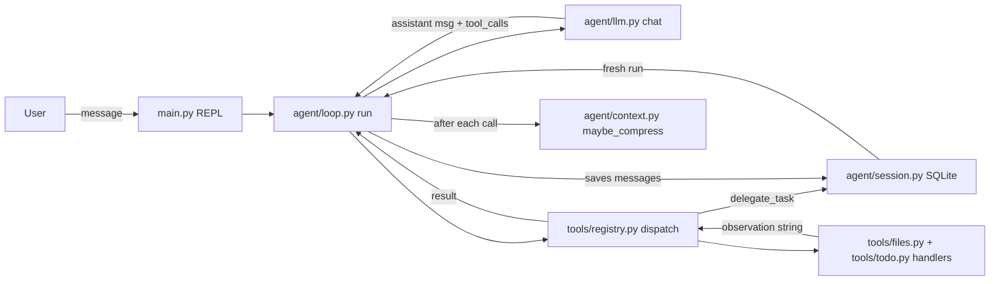
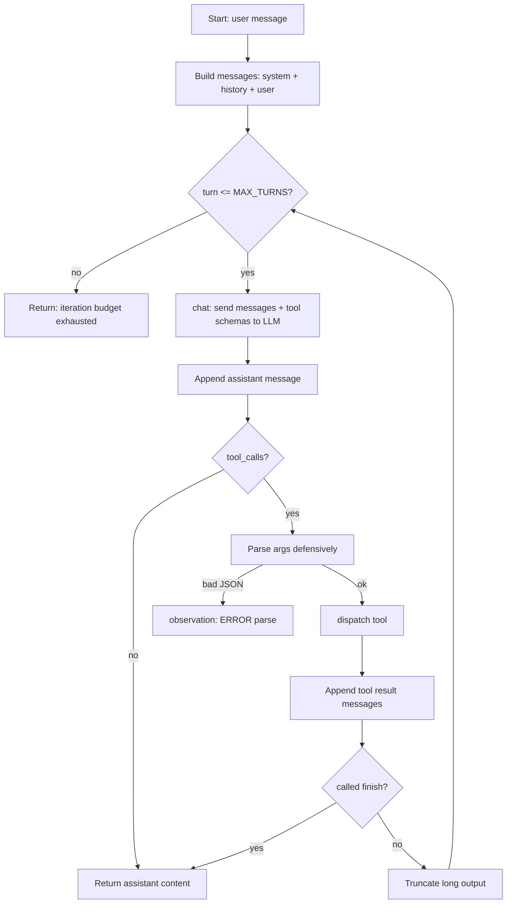
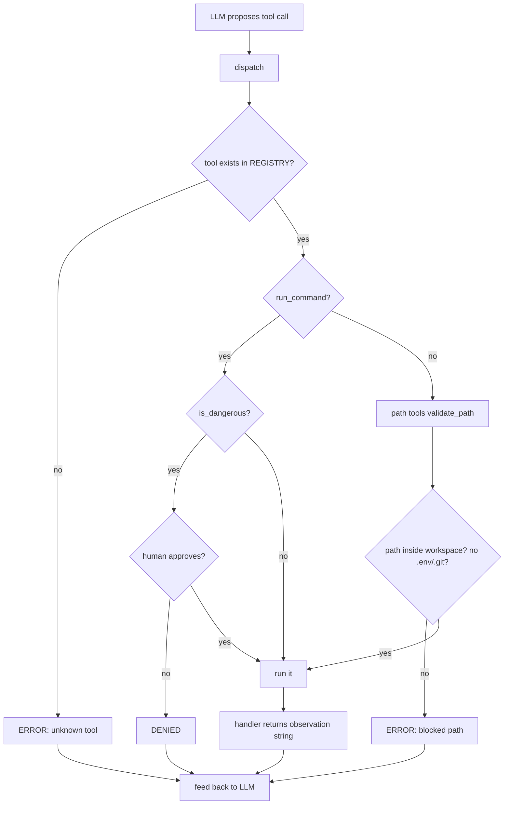
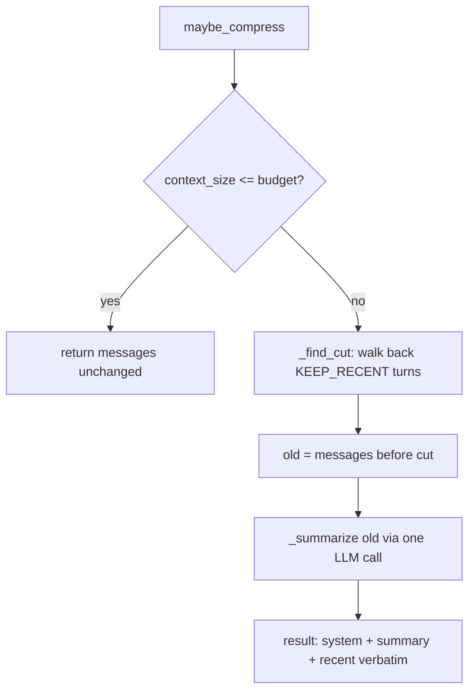
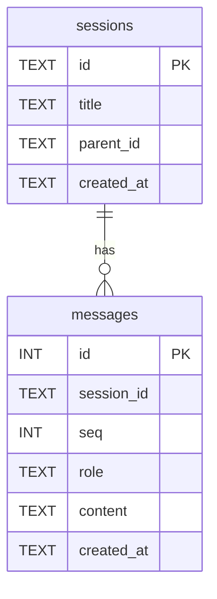
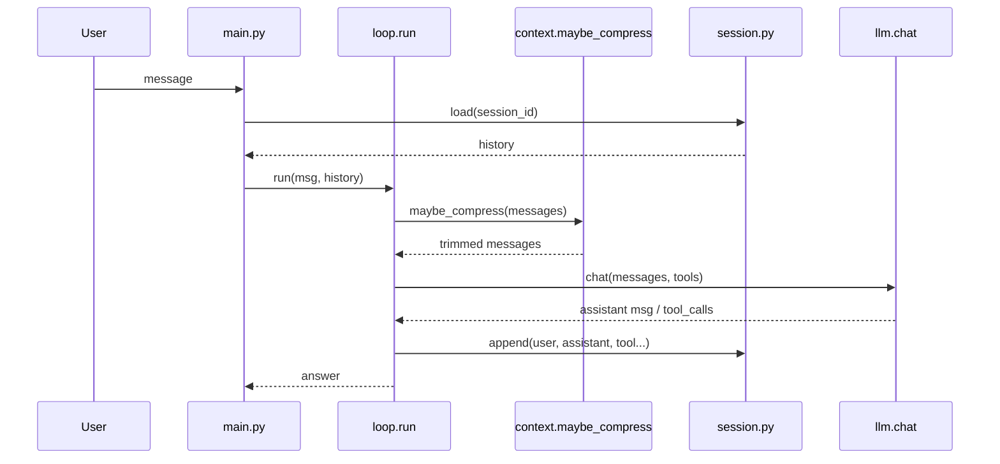
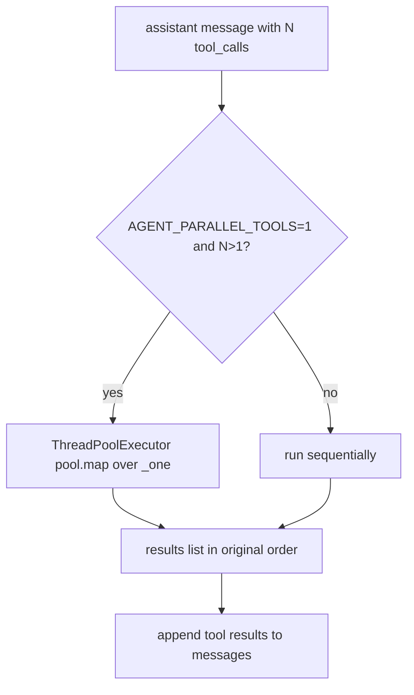
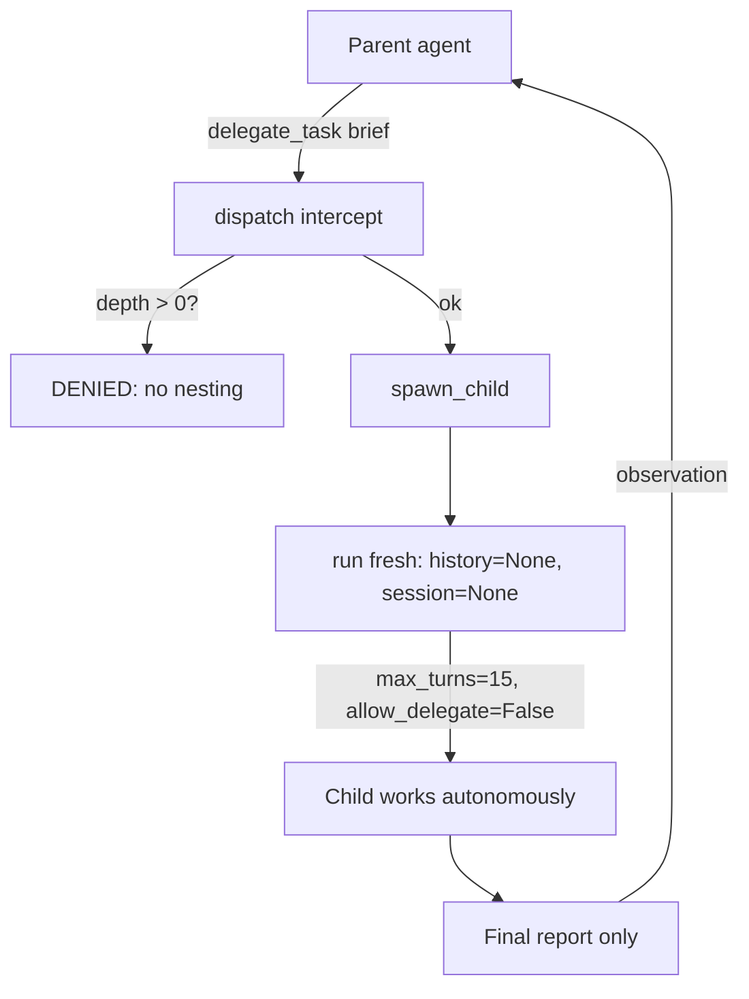
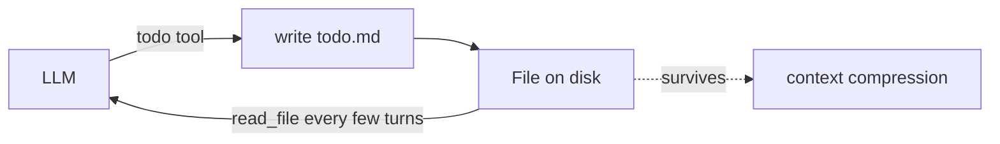

# Agent Architecture — How the System Works (Phase 1 → 5)

This document describes how this agent is built, phase by phase, with diagrams.

---

## Big Picture

The agent takes a user message, asks an LLM what to do, runs tools on the user's behalf (safely), and loops until the task is done.

---

## Phase 1 — The ReAct Loop (`agent/loop.py`, `agent/llm.py`, `agent/prompt.py`)

**Theory:** ReAct = Reason + Act. The model thinks, calls a tool, reads the result ("observes"), thinks again, until it can answer.

Key rules in the code:
1. Assistant message is appended **before** tool results (OpenAI requires this ordering).
2. Broken tool-call JSON becomes an `ERROR:` observation, never a crash.
3. Tool output is truncated to 2000 chars so one big file can't eat the context.
4. Hard budget of 25 turns; `finish` tool is the explicit stop signal.

`agent/prompt.py` sets the system prompt: THINK → ACT → OBSERVE → re-evaluate, verify before claiming success, never fabricate tool output.

---

## Phase 2 — Guardrails (`tools/registry.py`, `tools/approval.py`, `tools/sandbox.py`, `tools/files.py`)

**Theory:** The LLM is untrusted. Every tool call goes through one checkpoint (`dispatch`) that applies guardrails before anything touches the disk or shell.

### The three guardrails

| Guardrail | File | What it does |
|---|---|---|
| **Sandbox** | `tools/sandbox.py` | `validate_path()` resolves `../` tricks and only allows paths inside the workspace; blocks `.env`, `.git`, `.ssh`, `id_rsa`. |
| **Approval gate** | `tools/approval.py` | `is_dangerous()` blocklists patterns (`rm -rf`, `sudo`, `curl ... \| sh`); `request_approval()` asks a human. No TTY → deny (fail closed). |
| **Mediation + budget** | `tools/registry.py`, `agent/loop.py` | Only registered tools callable; unknown names rejected; errors become observations; output truncated; max 25 turns. |

`APPROVAL_CALLBACK` is a **seam**: swap the terminal `input()` for Telegram/Slack later without touching tools or registry.

---

## Phase 3 — Context & Sessions (`agent/context.py`, `agent/session.py`)

Two problems this phase solves:
1. **Context grows forever** → compress old turns.
2. **Chat dies when the program exits** → persist to SQLite.

### 3a. Context compression (`agent/context.py`)

- `count_tokens` / `context_size` measure total tokens.
- `_turn_start` finds where a turn begins (assistant msg + tool results) so cuts never split a turn.
- `_find_cut` walks backwards and marks the start of the "recent verbatim" zone (`KEEP_RECENT`, default 6 turns kept word-for-word).
- `_summarize` asks the LLM for a terse summary: goal, actions, files, state, remaining work.
- Final shape: `[system prompt, CONTEXT SUMMARY, ...recent messages]`.

### 3b. Session persistence (`agent/session.py`)

- `new_session()` → creates a session row, returns a 12-char id.
- `append()` → inserts a message with the next `seq` (append-only; never edit).
- `load()` → reads the session back in order as `[{role, content}]` — exactly what `run()` expects.
- `list_sessions()` → recent sessions + message counts.
- `parent_id` links child sessions (used when compression starts a fresh session).
- **Storage is truth, context is a view**: the in-memory message list is rebuilt by `load()`.

### How the loop changes (Phase 3 view)

---

## Phase 5 — Parallel Tools, Sub-Agents, Todo Memory

Three additions:

### 5a. Parallel tool execution (`agent/loop.py`)

If the model calls several tools in ONE message, they are treated as independent and run in a thread pool (up to 4 workers). Results are re-inserted in the ORIGINAL call order so the protocol stays valid:

Each tool call goes through the same `_one`: defensive JSON arg parsing, `delegate_task` permission check, `dispatch`. Errors are observations.

### 5b. Sub-agents (`agent/subagents.py`, registry's `delegate_task`)

The parent agent can delegate an independent sub-task to a fresh child agent:

- **Context isolation**: the child gets only a self-contained brief (no parent history) — that's the product feature.
- **Summaries, not transcripts**: parent receives only the child's final report (cheap tokens for heavy exploration).
- **Depth guard**: `threading.local` depth counter — depth >= 1 blocks further delegation. Thread-local because parallel tools would race on a global.
- **Security inherited**: child tool calls go through the same `dispatch()` chokepoint (sandbox, blocklist, approval).

### 5c. Todo memory (`tools/todo.py`)

The agent's plan lives in a FILE (`todo.md` in the workspace), rewritten wholesale each update:

Why a file, not chat: Phase 3 compression can delete old messages, but the plan file survives; re-reading it corrects drift ("I planned X but I've been doing Y"). Unlike append-only sessions, this scratch state is freely rewritten.

### 5d. Sessions upgraded (`agent/sessions.py`)

`messages` table now stores the full protocol (`tool_call_id`, `tool_calls` JSON) so `/resume` reconstructs a protocol-valid history the LLM accepts. `sessions.load()` rebuilds `tool_calls`/`tool_call_id` fields on messages.

### Updated summary

| Phase | Files | Purpose |
|---|---|---|
| 1 | `loop.py`, `llm.py`, `prompt.py` | ReAct agent loop with budgets and safe parsing |
| 2 | `registry.py`, `approval.py`, `sandbox.py`, `files.py` | Guardrails: mediation, sandbox, human approval |
| 3 | `context.py`, `sessions.py` | Token-budget compression + SQLite persistence |
| 5 | `subagents.py`, `todo.py`, `loop.py`, `registry.py`, `sessions.py` | Parallel tools, sub-agents, todo-as-memory, full protocol persistence |
