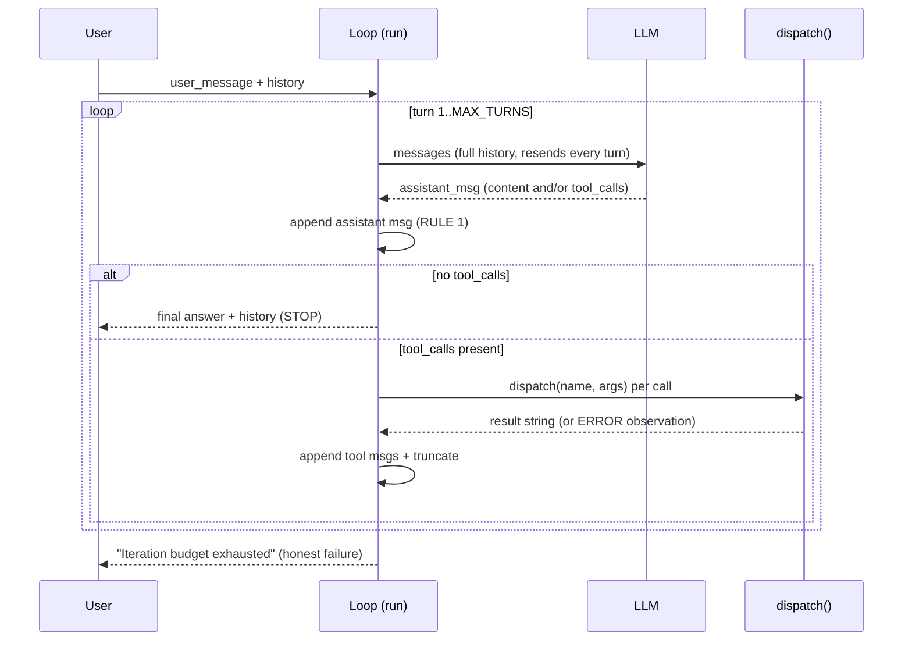

# Phase 1 — The Agent Core: The ReAct Loop

**Goal:** the minimum real agent — a loop where an LLM reasons, calls tools, observes results, and repeats until done. Everything else in this project is bolted around this file.

---

## 1. Theory (in detail)

### 1.1 The API is stateless — the single most important fact

The model has **no memory**. Every API call re-sends the entire conversation: system prompt, all prior messages, all tool outputs. What looks like "chatting" is you re-feeding history. Everything downstream (compression, sessions, cost growth) flows from this one fact.

### 1.2 The ReAct pattern

ReAct (Reason + Act) interleaves thinking and acting. Instead of "think privately, then answer," the agent:

1. **REASON** — the model reads the conversation and decides what to do next
2. **ACT** — it emits structured `tool_calls` (native function calling, not text parsing)
3. **OBSERVE** — the harness executes the tools and appends results as `tool` messages
4. repeat until the model produces a plain answer or calls `finish`

Why this beats one-shot prompting: a one-shot model must *imagine* the filesystem; a ReAct agent *checks* it. Errors become observations, which is how the agent self-corrects.

### 1.3 The message protocol (hard rules)

The chat-completions protocol has strict alternation rules. Violate them and the API rejects the request:

```
system → user → assistant(tool_calls) → tool → tool → assistant → user → ...
```

- **RULE 1**: always append the assistant message *before* its tool results. A `tool` message with no preceding `assistant.tool_calls` is an orphan → API error.
- An assistant message with `tool_calls` and no following `tool` results is also invalid.
- Multiple `tool` messages in a row are fine (they pair with multiple calls in one assistant message).

### 1.4 Errors are observations, not exceptions

If the model sends broken JSON arguments, you do **not** crash and do **not** silently skip. You append `"ERROR: could not parse tool arguments: ..."` as the tool result. The model reads the error and fixes itself. Same for tool-level failures. This is the difference between a brittle demo and an agent that recovers.

### 1.5 Truncation and budgets

- **`MAX_TOOL_OUTPUT`**: one `read_file` on a huge file must not eat the context. Truncate to 2000 chars with a `...[truncated]` marker.
- **`MAX_TURNS`**: a hard iteration budget (25). A confused model can loop forever ("read file, read file, read file…") — the budget caps the damage. When exhausted, return *"Iteration budget exhausted — task incomplete"* — an honest failure, not a fake success.

### 1.6 The explicit stop: `finish`

Two stop conditions: (a) the model answers with no tool calls (task complete), (b) the model calls `finish(summary, evidence)` — an explicit, evidence-backed declaration of done. `finish` is intercepted *before* the registry (it needs no execution); the loop returns its summary. Requiring evidence in the schema trains the model not to claim success without verification.

---

## 2. Papers to study (skim list)

| Resource | Take |
|---|---|
| [ReAct — arXiv 2210.03629](https://arxiv.org/abs/2210.03629) | The foundational paper: reasoning traces interleaved with actions |
| [Toolformer — arXiv 2302.04761](https://arxiv.org/abs/2302.04761) | Models learning *when* to call tools |
| [Hermes Agent docs](https://github.com/nousresearch/hermes-agent) | The production reference this whole project replicates |
| [Anthropic — Building effective agents](https://www.anthropic.com/research/building-effective-agents) | The loop as the core agentic pattern; workflows vs agents |

## 3. Main papers (read properly — 2)

1. **ReAct (2210.03629)** — the loop you're implementing. Read the AbstractionsQA/HotpotQA experiments; note how observations correct hallucinations.
2. **Anthropic — Building effective agents** — the practitioner's taxonomy: start with the simplest thing (a loop), add complexity only when measured failure demands it.

---

## 4. Code — the key parts

**`agent/llm.py`** — thin client; the only interesting part is normalizing the response:

```python
def chat(messages, tools):
    resp = client.chat.completions.create(
        model=os.getenv("MODEL", "openai/gpt-4o-mini"), messages=messages, tools=tools)
    out = {"role": "assistant", "content": msg.content or ""}
    if msg.tool_calls:
        out["tool_calls"] = [{"id": tc.id, "type": "function",
                              "function": {"name": tc.function.name,
                                           "arguments": tc.function.arguments}}
                             for tc in msg.tool_calls]
    return out
```

**`agent/loop.py`** — the skeleton; every rule from §1 lives here:

```python
def run(user_message, history=None):
    messages = [system] + (history or []) + [{"role": "user", "content": user_message}]
    for turn in range(1, MAX_TURNS + 1):
        assistant_msg = chat(messages, schemas())
        messages.append(assistant_msg)               # RULE 1: assistant BEFORE tools
        tool_calls = assistant_msg.get("tool_calls", [])
        if not tool_calls:
            return assistant_msg["content"], messages[1:]   # STOP: plain answer
        for tc in tool_calls:
            args = json.loads(...)                   # RULE 2: bad JSON -> ERROR observation
            result = dispatch(name, args)            # the ONLY door to the machine
            result = result[:MAX_TOOL_OUTPUT] + "...[truncated]"  # RULE 3
            messages.append({"role": "tool", "tool_call_id": tc["id"],
                             "content": result or "(no output)"})
    return "Iteration budget exhausted — task incomplete.", messages[1:]  # RULE 5
```

**Tools:** `read_file`, `write_file`, `run_command` (30s timeout), `finish` (intercepted before the registry — requires `summary` + `evidence`). Registry = dict name→handler + JSON schemas; `dispatch()` is the single entry the loop calls. (Phase 2 turns it into the security chokepoint.)

---

## 5. How it all works together



The whole agent is this picture. Two properties to remember:

1. **The context grows every turn** — that's the input to Phase 3.
2. **Everything the model does passes through `dispatch()`** — that's the input to Phase 2.

## 6. Exam (phase done when all pass)

| # | Test | Passes when |
|---|---|---|
| 1 | "What is 2+2?" | Zero tool calls, one turn, direct answer |
| 2 | "Read main.py and tell me how many lines" | `read_file` → observe → correct count |
| 3 | "Create hello.txt with 'hi', verify it" | `write_file` → `read_file` (self-verification) |
| 4 | "Make a folder test/ and list its contents" | `run_command` chain works |
| 5 | "Read /nonexistent.txt" | Error comes back as an observation; agent explains, doesn't crash |
| 6 | Task requiring >25 turns | Honest "iteration budget exhausted", no hang |

**Commit:** *"agent core works: ReAct loop with native tool calling, honest failures."*
