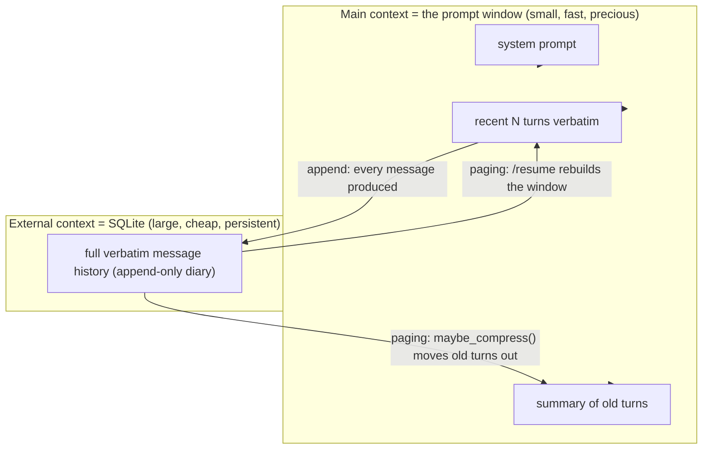
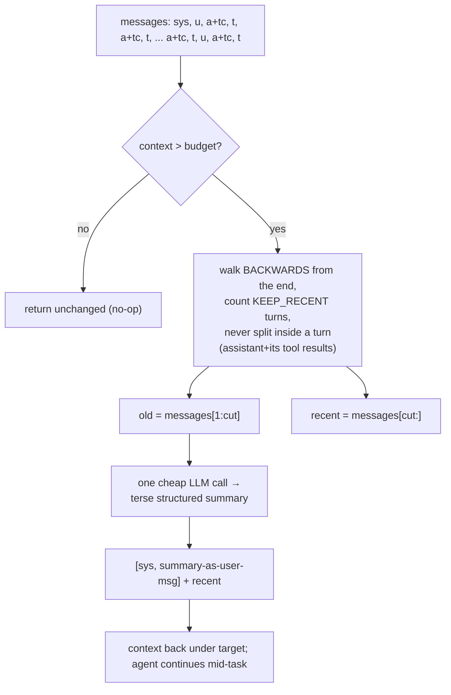
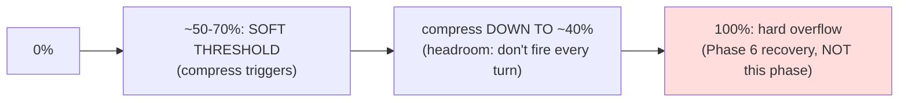
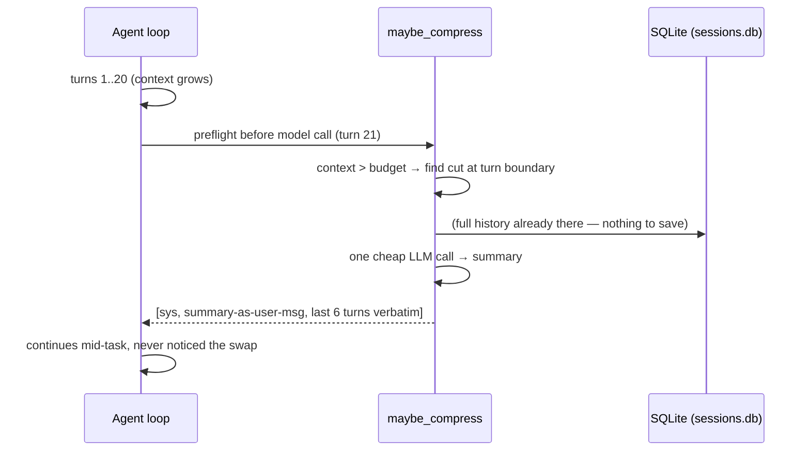
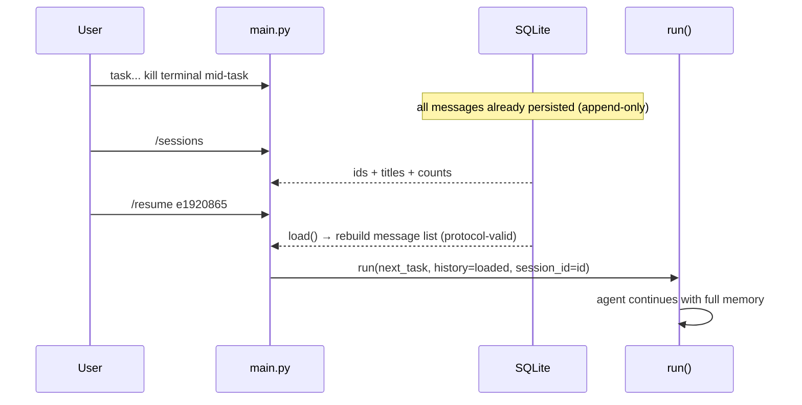

# Phase 3 — Context, Compression & Sessions

**Goal:** the agent that doesn't die of its own memory — long tasks stop overflowing the context window, and conversations survive restarts.

---

## 1. Theory (in detail)

### 1.1 Context is the scarce resource

Every turn re-sends the *entire* history (the API is stateless — Phase 1 §1.1). Three consequences:

1. **Cost grows super-linearly.** Turn 40 re-sends turns 1–39 plus their tool outputs. You don't pay for turn 40 — you pay for all 40, again, every time.
2. **Overflow is guaranteed.** One long task and the API starts rejecting calls. `MAX_TOOL_OUTPUT` slows growth but can't prevent it.
3. **Quality degrades before it breaks.** Even *below* the limit, the agent gets dumber as context grows. Waiting for the hard error is waiting too late.

Compression solves *within a task*; sessions solve *across tasks*. They must compose without knowing about each other.

### 1.2 Context rot: the attention budget

Attention is a fixed budget spread across all tokens. The transformer computes n² pairwise relationships — 2k tokens = 4M pairs (manageable); 100k = 10 billion (stretched thin). A critical fact at token 60,000 gets the same *mechanical* treatment as filler. Chroma's "Context Rot": degradation is smooth across all models, even million-token ones. "My model has 200k tokens" is not an excuse to skip this phase — it's the reason it exists.

**North star (Anthropic):** find the *smallest set of high-signal tokens* that maximizes correct behavior. Not "fit more in" — "need less in."

### 1.3 Lost in the Middle: position is a resource

The experiment hid facts at different positions in long contexts. Result: performance is **U-shaped** — great at start and end, worst in the middle. The model "has" the information and still fails to use it.

Design consequence: what the agent needs *now* belongs at the **end** (recency = strongest attention); stable rules at the **start** (system prompt); stale-but-relevant facts in a **summary at the top**. Compression is not just deletion — it's **repositioning**.

### 1.4 MemGPT: the memory hierarchy



Treat context like **RAM** and SQLite like **disk**. The harness pages old turns out and distills them into a summary that stays resident. Like an OS swapping, compression must **never destroy information** — verbatim data moves to disk; a distilled copy stays in RAM.

### 1.5 The compression contract

```
[system prompt]        ← untouched (identity, rules)
[summary message]      ← NEW: goal, actions, files touched, state, remaining
[recent N turns]       ← untouched verbatim (the live reasoning chain)
```

Three invariants a correct implementation never breaks:

1. **Protocol pairing (atomicity):** an assistant message with `tool_calls` and its `tool` results are ONE atomic unit. Never compress between them — the API rejects orphans. Compress only at **turn boundaries** (after a complete reason→act→observe cycle).
2. **Never compress the current turn:** the model is mid-thought; recent turns are also where the U-curve says attention is strongest.
3. **The summary is written by an LLM call, not string-slicing.** "What matters" is semantic, not statistical. One cheap call buys many turns of coherence.



### 1.6 What to keep vs discard: recall first, then precision

Anthropic's tuning rule: when tuning the summary prompt on real traces, **err toward keeping everything relevant** (losing a constraint the user mentioned in passing is worse than being verbose), then cut fluff. And the cheapest lever of all, before any summarization: **tool result clearing** — old tool outputs are the biggest, lowest-value occupant of the window (Hermes docs confirm: verbose text, not media, is what eats context).

### 1.7 When to compress: watermark, not panic



- Count tokens every turn (tiktoken if available; `chars ÷ 4` heuristic is fine for thresholds).
- Compress **proactively** at a soft threshold (Hermes: >50%), compress *down to* a target (~40%) — headroom so consecutive-turn triggering means your thresholds are wrong.
- Both numbers env-configurable; during testing set the budget artificially low (`AGENT_CONTEXT_BUDGET=1500`) so compression fires in a 5-turn task.

### 1.8 Sessions: durability is a different axis

`run()` returns history into a Python variable that dies with the process. Kill the terminal mid-task → everything is lost. Sessions solve **across-run** persistence. Three principles:

1. **Append-only (a diary, not a whiteboard).** Only ever INSERT new rows. A process that dies mid-write leaves the log intact up to the last complete entry. Contrast: rewriting a JSON file in place corrupts it if you die halfway.
2. **SQLite over JSON:** atomic inserts (crash-safe), scales to thousands of messages, *queryable* (counts, listings, dates) — and the same table becomes the Phase 7 FTS5 search index. Choosing SQLite now *is* choosing the Phase 7 foundation.
3. **Storage is truth; context is a view.** The DB stores the raw message stream (session_id, seq, role, content, tool_call_id, tool_calls, timestamp). The context window is *recomputed* from stored messages every run — never stored separately. If context were persisted you'd have two sources of truth that drift apart. One store, many views. (Bank ledger vs banking-app screen.)

**Resume:** load messages by seq order → rebuild exactly the list `run()` expects. The full protocol is stored (`tool_call_id`, `tool_calls` JSON) so a resumed history is API-valid.

**Lineage (Hermes refinement):** compression creates a **child session** (`parent_id` link). The compressed continuation lives in the new session; the original verbatim history stays intact forever. Compression then genuinely never destroys information. One nullable column now; impossible to retrofit cheaply later.

### 1.9 Architecture: where the hooks go

Same layering discipline as Phase 2 — the loop stays dumb:

- `agent/context.py` — token counting + `maybe_compress`. Pure-ish: list in, list out. No SQLite, no UI.
- `agent/sessions.py` — persistence only. SQLite in/out, no LLM calls, no compression.
- `loop.py` — exactly two hooks: `maybe_compress` before each model call; `sessions.append` for every message produced.

The test: if a future phase (Telegram, subagents, FTS5) requires touching the loop, the layering is wrong. Phase 5's children call the same `run()`; Phase 7's search queries the same table; neither touches the loop.

---

## 2. Papers to study (skim list)

| Resource | Take |
|---|---|
| [Lost in the Middle — arXiv 2307.03172](https://arxiv.org/abs/2307.03172) | The U-shaped curve; why position matters |
| [MemGPT — arXiv 2310.08560](https://arxiv.org/abs/2310.08560) | RAM/disk metaphor; paging |
| [Context Rot — Chroma](https://research.trychroma.com/context-rot) | Degradation is smooth, not a cliff |
| [Anthropic — Effective context engineering](https://www.anthropic.com/engineering/effective-context-engineering-for-ai-agents) | Compaction, attention budget, "context is a finite resource" |
| [StreamingLLM — arXiv 2309.17453](https://arxiv.org/abs/2309.17453) | Why "recent verbatim" works (attention sinks) |
| [SQLite FTS5 docs](https://www.sqlite.org/fts5.html) | Phase 7 foundation — skim now |
| [tiktoken](https://github.com/openai/tiktoken) | Token counting |

## 3. Main readings (properly — 3)

1. **Lost in the Middle (2307.03172)** — the empirical basis for compression-as-repositioning. Experiment setup + Figure 1.
2. **MemGPT (2310.08560)** — the architecture this phase implements. Memory hierarchy + paging sections.
3. **Anthropic — Effective context engineering for AI agents** — the practitioner's design doc: compaction, recall-then-precision, attention budget.

---

## 4. Code — the key parts

**`agent/context.py`** — the three functions that matter:

```python
CONTEXT_BUDGET = int(os.getenv("AGENT_CONTEXT_BUDGET", "24000"))  # soft threshold
KEEP_RECENT    = int(os.getenv("AGENT_KEEP_RECENT", "6"))         # turns verbatim
COMPRESS_TO    = 0.4                                              # target: 40%

def maybe_compress(messages):
    if context_size(messages) <= CONTEXT_BUDGET:
        return messages                                  # no-op under budget
    cut = _find_cut(messages)                            # backwards walk, turn
    old, recent = messages[1:cut], messages[cut:]        # boundaries ONLY
    if not old:
        return messages                                  # nothing compressible yet
    return [messages[0], _summarize(old)] + recent       # [sys, summary, recent]

def _find_cut(messages):
    """Walk BACKWARDS from the end counting KEEP_RECENT turns. When hitting an
    assistant msg with tool_calls, jump to the START of its turn (_turn_start) —
    never split an assistant message from its tool results (atomicity)."""
    ...

def _summarize(old):
    """One cheap LLM call: goal / actions+results / files touched / state /
    what remains. Returns a user-role message: '[CONTEXT SUMMARY of earlier
    turns] ...' — a note handed to the agent, not a false memory."""
    ...
```

(Token counting: `tiktoken` when installed, else `len(text)//4` heuristic — fine for thresholds.)

**`agent/sessions.py`** — the schema IS the design:

```python
DB_PATH = "sessions.db"
# sessions:  id, title, parent_id (lineage), created_at
# messages:  session_id, seq, role, content, tool_call_id, tool_calls, created_at
#            ^ append-only: INSERT only, never UPDATE/DELETE messages

def append(session_id, role, content, tool_call_id=None, tool_calls=None):
    seq = SELECT COALESCE(MAX(seq),-1)+1 ...             # next diary line
    INSERT INTO messages ...                             # atomic, crash-safe

def load(session_id):
    rows = SELECT role, content, tool_call_id, tool_calls ... ORDER BY seq
    # rebuild EXACTLY the list run() expects: restore tool_calls JSON on
    # assistant msgs, tool_call_id on tool msgs -> /resume is API-valid
```

**`loop.py`** — the only two lines added (hooks stay dumb):

```python
messages = maybe_compress(messages)          # HOOK 1: before every model call
sessions.append(session_id, role, content)   # HOOK 2: for every message produced
# (assistant rows also store tool_calls JSON; tool rows also store tool_call_id)
```

**`main.py`** — REPL commands mapping 1:1 to sessions.py: `/new`→`new_session()`, `/sessions`→`list_sessions()`, `/resume <id>`→`load(id)` passed as `history=`, `/title <name>`→`set_title()`. First message auto-titles.

---

## 5. How it all works together

**One long task:**



**Restart + resume:**



**Why the summary is a `user`-role message:** it reads as a note *handed to* the agent, not a false memory of its own reasoning. Protocol-safe and correctly interpreted.

**Why `KEEP_RECENT` verbatim:** the current reasoning chain lives there (what it just read, just tried). Compressing it lobotomizes the agent mid-task — and the U-curve says recency is the highest-attention real estate anyway.

**Verified offline (Phase 3 smoke tests):** protocol restore round-trip (`tool_calls` + `tool_call_id` survive `load()`); 7501 → 1504 tokens at `AGENT_CONTEXT_BUDGET=1500` with summary-first output; under-budget = strict no-op; `list_sessions` returns titles + counts.

## 6. Exam (phase done when all 4 pass)

| # | Test | Passes when |
|---|---|---|
| 1 | `AGENT_CONTEXT_BUDGET=1500`, long multi-file task | Compression fires mid-task; task completes; no protocol errors (no orphan tool results) |
| 2 | Inspect compressed conversation | Summary has goal + files + what remains; recent turns verbatim |
| 3 | Task → kill process → `/resume` | Agent continues with full memory |
| 4 | Three conversations → `/sessions` | Three rows with titles and counts |

**Commit:** *"agent survives long tasks and restarts: token-budgeted compression + SQLite session persistence with lineage."*
