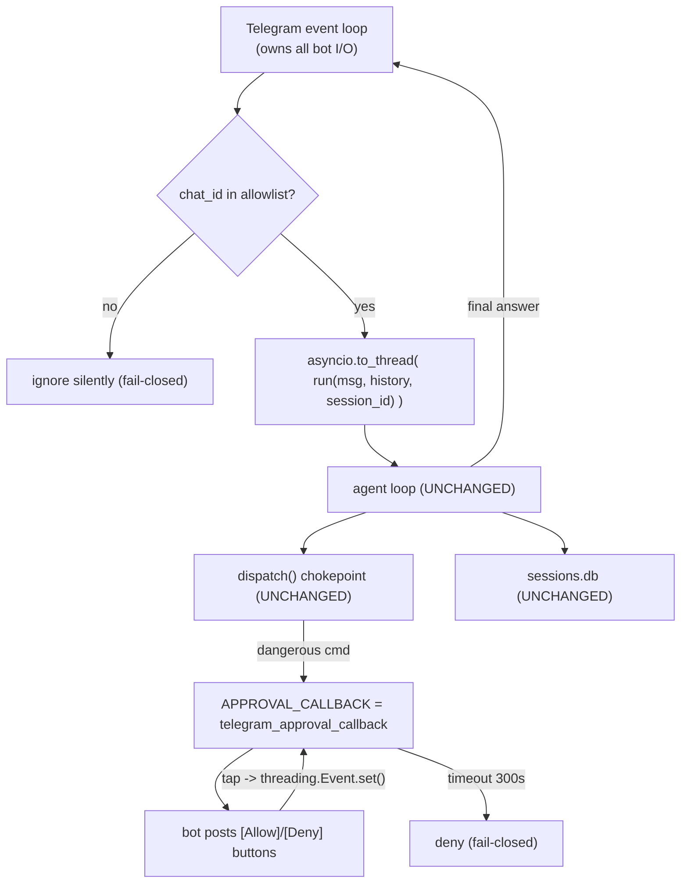

# Phase 4 — Interfaces (Telegram Gateway) — **SKIPPED (DEFERRED)**

**Status:** deliberately deferred to the END of the roadmap. No code was written for this phase yet — by design, not by accident.

---

## Why skipped

1. **Ordering by dependency, not convenience.** The gateway is an *adapter* — it adds no new agent capability. It only becomes worth building once the agent underneath it can actually do things: tools (P1–2), memory (P3), sub-agents (P5), reliability (P6), search (P7). Wrapping a weak agent in a nice interface is polishing an empty shell.
2. **The hard parts are already built.** Hexagonal architecture means the gateway is a *caller* of two existing ports: `run(user_message, history, session_id)` and `APPROVAL_CALLBACK`. Phase 4's entire integration is one line: `approval.APPROVAL_CALLBACK = telegram_approval_callback`. Nothing above `approval.py` changes — that was proven by design in Phase 2 and is the reason deferral is cheap.
3. **User decision:** stay in the terminal; implement Telegram last, after the agent is complete. The CLI remains the primary adapter until then.

## What it WILL be (when built — the plan is already fixed)

**Theory it will apply:**

- **Ports & adapters (hexagonal):** loop, tools, sessions = core; CLI and Telegram = interchangeable adapters. If adding Telegram forces edits to `loop.py` or `registry.py`, the layering is broken.
- **Threat model escalation:** the CLI had no external channel; Telegram IS one (lethal trifecta leg 3 returns). So the gateway's first feature is **authentication, fail-closed**: a `TELEGRAM_ALLOWED_CHAT_IDS` allowlist checked *before* the message ever reaches `run()` — complete mediation, one layer up. Prompt injection now has a delivery vehicle; Phase 2's sandbox + approval are what stand between a malicious forwarded message and your disk.
- **Two clocks, two worlds:** the loop is blocking (a task takes minutes); Telegram is event-driven. The fix: agent tasks run in worker threads (`asyncio.to_thread`), the bot's event loop stays free. One message = one task = one thread.
- **Approval over the wire:** the callback's second implementation — sends the command with [Allow]/[Deny] inline buttons, blocks on a `threading.Event`, **fails closed after a 300s timeout** (Hermes parity).
- **Chats are sessions:** each chat maps to a session id; `/new`, `/sessions`, `/resume` reuse `sessions.py` unchanged.

**Planned shape:**

**Deferred exam** (same shape as other phases): unknown chat ignored; Deny button → teaching denial; Allow → runs; timeout → fail-closed deny; `/resume` across bot restarts; CLI still works alongside.

**Resources for later:** Cockburn's Hexagonal Architecture essay; Telegram Bot API (long polling, inline keyboards, callback queries); python-telegram-bot guide; OWASP LLM Top 10 (LLM01 prompt injection).
