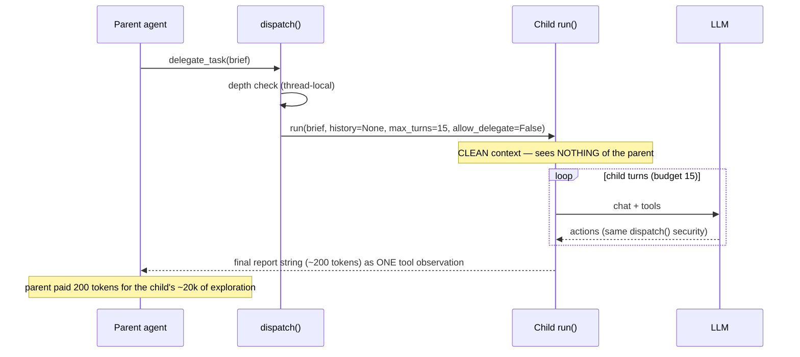
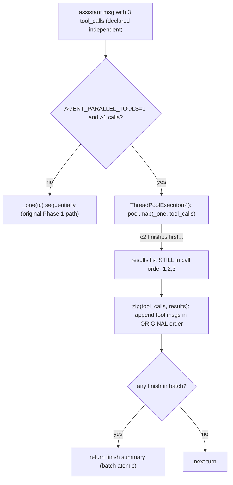

# Phase 5 — Agentic Capabilities: Sub-agents, Plans & Parallel Tools

**Goal:** the agent stops being a single worker and becomes a team. Three features: `delegate_task` (sub-agents), `todo` (persistent plan), parallel tool execution.

---

## 1. Theory (in detail)

### 1.1 The problem: one context cannot hold a big task

Phase 3's compression is *defensive* — it salvages an already-polluted window. Phase 5 is *offensive*: prevent pollution and extend capability. A big task forces one agent to hold everything it read and every dead end it hit — mostly *exploration debris*, needed briefly, never again. Anthropic's sub-agent insight:

> Specialized workers each explore with a **clean context** and return only **distilled findings** to the orchestrator.

The economics: a child burns 20k tokens of *its own* window reading 15 files; the parent pays 200 tokens for the summary. Exploration becomes cheap in the currency that matters — parent attention. (Your `tech_team` project was this pattern hardcoded in LangGraph; Phase 5 is the **agent-decides** version — the orchestrator is your own ReAct loop spawning workers via a tool.)

### 1.2 The core idea: a sub-agent is just `run()` called recursively

- A child = one fresh `run()` with: a **task brief** as the user message, **empty history**, a **smaller budget** (15 vs 25 turns), **no session**.
- The child gets **zero parent context** — not a limitation, the product. Context isolation is the point.
- The child runs the same loop, same tools, same system prompt, same Phase 2 security.
- Its **final answer string** becomes the `delegate_task` tool result in the parent's conversation.

`delegate_task` is a tool whose handler is "run a whole agent."



### 1.3 Why free recursion kills agents — the four guards

All *structural* (enforced in code, not prompts — the Phase 2 lesson):

1. **Depth limit.** Children may not spawn children. Eliminates infinite recursion *by construction* — no prompt can talk past a code check. Guard lives in `dispatch()` (complete mediation: no path can spawn a child except through the chokepoint).
2. **Smaller budget.** 15 turns. A runaway child self-terminates in bounded time. Budgets are safety devices, not performance knobs.
3. **Ephemeral children.** No sessions. The parent's session records one line: "delegated X, got report Y" — the delegation observation IS the audit trail.
4. **Inherited security.** Phase 2's complete mediation means the child's calls go through the same `dispatch()` — sandbox, blocklist, approval apply with **zero extra code**.

**Race-safety detail:** with parallel tools, a global depth counter is racy (two pool workers could each think they're at depth 0). Hence `threading.local()` — each thread owns its depth.

### 1.4 The delegation contract — the #1 practical failure point

- **Input: a self-contained brief.** The child cannot ask questions mid-run (no shared memory). The parent must pack goal, constraints, paths, and "what done means" into the task string. Vague brief = useless child. That's why the tool *description itself* coaches the model to write self-contained briefs — the schema is part of the safety design.
- **Output: a summary, never a transcript.** The child's final answer lands in the parent's context as one observation. Returning full history would reintroduce the exact pollution this architecture prevents.

### 1.5 The `todo` tool: structured note-taking (agentic memory)

The agent writes and rewrites its plan to a **file** (`todo.md`), not to context:

- **Attention insurance:** the plan lives on disk (MemGPT's disk tier). Compression eats the conversation's middle; the plan survives verbatim. The summary says *what happened*; the todo file says *what must still happen*.
- **Drift correction:** re-reading its own plan lets the agent catch itself ("I planned the import fix first, but I've been on CSS for 6 turns") — self-correction without a human watching.
- **Two storage disciplines:** the todo file is *agent-owned scratch state*, freely rewritten (a view of the plan); sessions are *append-only truth*. Different data, different rules.

### 1.6 Parallel tool execution: latency without correctness cost

On "read a.py, b.py, c.py and compare," the model emits three calls in ONE assistant message — Phase 1 ran them sequentially.

- **Independence is declared by the model:** multiple `tool_calls` in one message = an assertion that they don't depend on each other. That's your license to parallelize — no analysis needed.
- **Threads, not processes:** the work is I/O-bound (LLM API, subprocess, HTTP).
- **THE ordering rule (Hermes parity):** results must be re-inserted in the **ORIGINAL call order** regardless of completion order. The protocol pairs each `tool` result with its `tool_call_id`, and the model reads results as an ordered list matching its calls. Out-of-order insertion = garbage conversation. Fix: compute results into a list *by index* (`pool.map` preserves order), then append in order.
- **Escape hatch:** `AGENT_PARALLEL_TOOLS=0` → sequential (the `tech_team` free-model lesson: rate-limited providers need it).
- **`finish` unchanged:** honored after the whole batch is collected and re-inserted — the batch is atomic.



### 1.7 Architecture: what's allowed to change

First phase permitted to touch the loop — surgically:

- **`agent/subagents.py`** (new): `spawn_child()` + thread-local depth guard. No model awareness.
- **`tools/todo.py`** (new): dumb file I/O.
- **`tools/registry.py`**: two schemas; `delegate_task` intercepted *before* the registry (Hermes agent-level pattern, same as `finish`).
- **`agent/loop.py`**: exactly two edits — `run()` gains `max_turns`/`allow_delegate`; the sequential block becomes pool + ordered reinsertion.

The pattern across all phases: **the loop stays dumb; capability is added underneath.** The loop doesn't know what a sub-agent is — it sees a tool result containing a report.

---

## 2. Papers to study (skim list)

| Resource | Take |
|---|---|
| [Anthropic — Effective context engineering](https://www.anthropic.com/engineering/effective-context-engineering-for-ai-agents) | Re-read the sub-agent section — now implementation-relevant |
| [Tree of Thoughts — arXiv 2305.10601](https://arxiv.org/abs/2305.10601) | Isolated exploration branches (background) |
| [Chain-of-Agents — arXiv 2406.02818](https://arxiv.org/abs/2406.02818) | Sequential context relay — the *contrast* case |
| [AutoGen — arXiv 2308.08155](https://arxiv.org/abs/2308.08155) | Multi-agent orchestration vocabulary |
| [Claude Code best practices](https://www.anthropic.com/engineering/claude-code-best-practices) | The plan-file pattern in production |
| [Hermes docs — subagents & parallel tools](https://github.com/nousresearch/hermes-agent) | Engineering parity: budgets, ordering rule, agent-level interception |

## 3. Main readings (properly — 3)

1. **Anthropic — How we built a multi-agent research system** — [link](https://www.anthropic.com/engineering/built-multi-agent-research-system). When to spawn vs do the work, why summaries-not-transcripts, candid failure modes (token burn, runaway agents).
2. **ReWOO (2305.18323)** — [arXiv](https://arxiv.org/abs/2305.18323). Plan-then-execute; batch independent calls. §3 matters.
3. **Least-to-Most (2205.10625)** — [arXiv](https://arxiv.org/abs/2205.10625). Decomposition; subproblem solutions generalize beyond direct solving.

---

## 4. Code — the key parts

**`agent/subagents.py`** — the whole concept in one function + the guard:

```python
_tls = threading.local()
CHILD_MAX_TURNS = 15

def depth(): return getattr(_tls, "depth", 0)     # thread-local: parallel-safe

class DepthGuard:                                  # +1 on enter, -1 on exit
    ...

def spawn_child(task: str) -> str:
    from agent.loop import run
    with DepthGuard():
        answer, _ = run(f"{BRIEF_SUFFIX}\n\nTASK:\n{task}",
                        history=None, session_id=None,       # ephemeral
                        max_turns=CHILD_MAX_TURNS,
                        allow_delegate=False)                # depth limit by construction
    return answer                                            # summary, NOT transcript
```

(`BRIEF_SUFFIX` tells the child: self-contained task, no other context, finish with a concise report, don't ask questions.)

**`tools/registry.py`** — the intercept at the chokepoint (Hermes agent-level pattern):

```python
def dispatch(name, args) -> str:
    if name == "delegate_task":                       # BEFORE the registry
        if depth() > 0:
            return "DENIED: sub-agents cannot delegate. Do the work yourself..."
        task = str(args.get("task", "")).strip()
        if not task:
            return "ERROR: 'task' is required and must be a self-contained brief..."
        return spawn_child(task)
    ...                                               # Phase 2 checks unchanged
```

(The `todo` tool is just file I/O: write `items` list to `todo.md`, return confirmation. Its schema coaches: "rewrite the FULL list, mark [x], re-read it to stay on plan — it survives compression.")

**`agent/loop.py`** — the two surgical edits:

```python
def run(user_message, history=None, session_id=None,
        max_turns=MAX_TURNS, allow_delegate=True):    # edit 1: budgets
    ...
    def _one(tc):
        name = tc["function"]["name"]
        if name == "delegate_task" and not allow_delegate:
            return "DENIED: sub-agents cannot delegate..."   # loop-level backstop
        ...parse args (RULE 2)... return dispatch(name, args)

    # edit 2: the model emitting >1 call in ONE message declared independence
    if os.getenv("AGENT_PARALLEL_TOOLS", "1") == "1" and len(tool_calls) > 1:
        with ThreadPoolExecutor(max_workers=4) as pool:
            results = list(pool.map(_one, tool_calls))   # ORDER preserved by map
    else:
        results = [_one(tc) for tc in tool_calls]

    for tc, result in zip(tool_calls, results):          # ORIGINAL order reinsertion
        ...truncate, append tool msg, sessions.append...  # all Phase 1/3 rules intact
```

---

## 5. How it all works together

**A delegation's life:** parent gets a big request → writes its plan via `todo` → spots an independent subtask → calls `delegate_task` with a self-contained brief → `spawn_child` runs a fresh `run()`: clean context, 15 turns, no delegation rights, same `dispatch()` security → child explores with its own window, burns 20k tokens nobody ever sees → returns a 200-token report → it lands in the parent's context as **one tool observation**.

**The three features reinforce each other:** the todo list makes long tasks resumable after compression; parallel tools cut wall-clock time on independent steps; delegation isolates exploratory token burn. None knows about the others — they meet only at `dispatch()` and the loop.

**Verified offline (smoke tests):** depth-guard denial fires inside a `DepthGuard` block and depth restores to 0 after; empty delegate brief → teaching ERROR; the delegate path reaches a real child `run()` (child budget `--- turn 1/15 ---` printed before the expected offline 401).

## 6. Exam (phase done when all 6 pass)

| # | Test | Passes when |
|---|---|---|
| 1 | "Read a.py, b.py, c.py and compare" | Three `⚡ ACT` lines near-simultaneously; results pair with the right `tool_call_id`s; `AGENT_PARALLEL_TOOLS=0` falls back to sequential |
| 2 | "Investigate docs/ and report the best config format" | Child runs (its prints visible), parent gets a concise report, parent's context never inflates |
| 3 | `/sessions` after a delegation | Only the parent session exists — children are ephemeral |
| 4 | Child tries to delegate | DENIED with the teaching message; child finishes its own work |
| 5 | Long multi-file task, low `AGENT_CONTEXT_BUDGET` | Compression fires; agent re-reads `todo.md` and stays on-plan |
| 6 | Child attempts `read_file("../../.env")` | Phase 2 sandbox denies — security inherited automatically |

**Commit:** *"agent becomes a team: sub-agent delegation with depth guard, persistent plan file, parallel tool execution with ordered reinsertion."*
