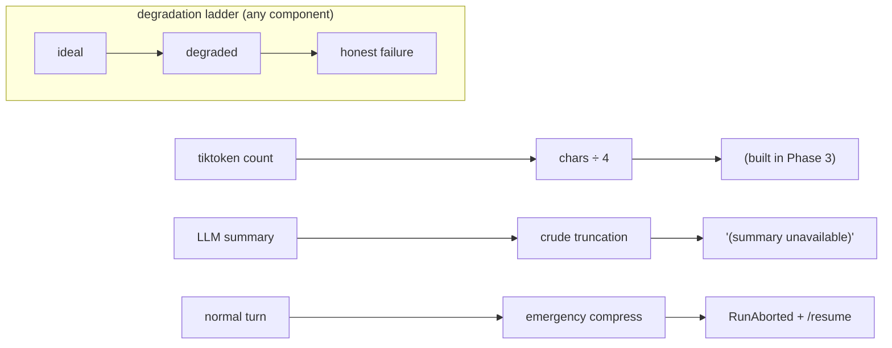
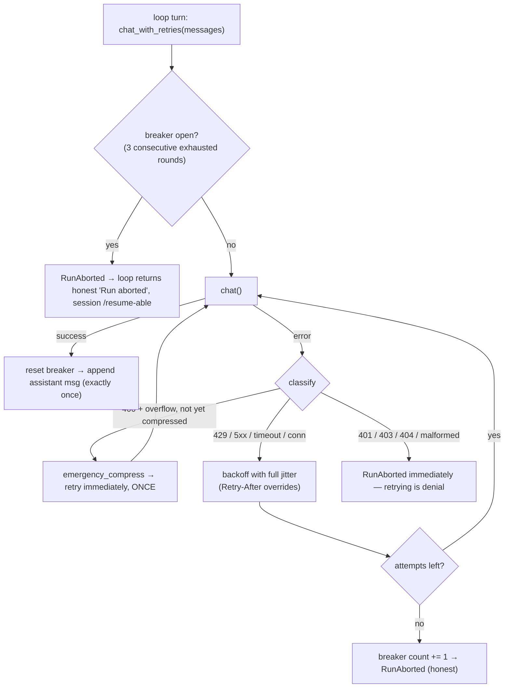

# Phase 6 — Reliability & Recovery

**Goal:** the agent that keeps working when the world misbehaves — API errors, rate limits, timeouts, and its own context overflow. Your `tech_team` retry loop, formalized.

---

## 1. Theory (in detail)

### 1.1 Everything is a remote dependency

Every `chat()` call is an HTTP request to a service you don't control. It *will* fail. The task is not preventing failure — it's **classifying** failures and responding correctly to each class. The wrong response to the right failure is as bad as no response.

| Class | Examples | Right response |
|---|---|---|
| **Transient** | 429 rate limit, 500/502/503/529 overloaded, connection reset, timeout | Retry with backoff — same request likely succeeds |
| **Persistent** | 401/403 bad key, 404 bad model, 400 malformed | Never retry — fix or abort honestly |
| **Self-inflicted** | context-length overflow | Not an API bug — emergency compression, then ONE retry |

Retrying a 401 burns turns; not retrying a 429 kills the run. The classification *is* the design.

### 1.2 The harness layer vs the model layer — who handles what

Falls straight out of Phase 1's "errors are observations":

- **Tool errors become observations.** The model *sees* `ERROR: file not found` and self-corrects. The model is in the loop.
- **API errors cannot be observations.** If `chat()` fails there is no assistant message — the model never got a turn. It cannot react to its own absence. **The harness handles these itself**, below the model's awareness.

```
loop turn:
    chat_with_retries(messages)   ← harness: classify, backoff, emergency compress
    maybe_compress(messages)      ← preflight (Phase 3)
    dispatch(...)                 ← model layer: tool errors = observations
```

### 1.3 Retry theory: backoff, jitter, budget

- **Exponential backoff:** wait 1s, 2s, 4s, 8s… Linear waits hammer a struggling service; exponential lets it breathe. **Respect `Retry-After`** when a 429 provides it — the server knows better than you.
- **Jitter:** if 1,000 clients all retry at t+2s, you've built a synchronized stampede (thundering herd). Full jitter: `wait = random.uniform(0, min(cap, base * 2^attempt))` — AWS's empirical result is that this beats every deterministic scheme.
- **Retry budget:** 3–4 attempts max, then give up *honestly*. Infinite retry against a 429 is a self-inflicted DoS on your own quota.
- **Idempotency:** retrying `chat()` is safe — no side effects until a response arrives. We never retry *tools* at this layer (a retried `write_file` is not idempotent).

### 1.4 Consecutive-failure circuit breaker

Backoff handles blips, not outages. Retrying 4× per turn while the API is down burns quota for nothing. The breaker: track **consecutive** exhausted rounds; past a threshold (3), abort immediately with an honest message and a preserved session — `/resume` continues when the provider recovers. Same fail-safe philosophy as Phase 2, applied to infrastructure instead of security.

### 1.5 Overflow recovery: when preflight isn't enough

Phase 3 compresses proactively at ~50%, but overflow can still slip through (a giant tool result, a huge summary, tokenizer disagreement between client estimate and server). Emergency path: on a context-length rejection, **fix the payload and retry ONCE** — drop tool outputs >1000 chars, force-summarize everything except system + last few messages. One retry: if emergency compression doesn't fix it, something is structurally wrong and retrying is denial. Hermes implements this as separate turn phases (`turn_overflow` → `turn_recovery`) rather than inline spaghetti.

### 1.6 Degradation ladders, not cliffs

Every fallible helper gets a fallback chain — the loop must never crash because a nice-to-have failed:



The loop may only stop on: task complete, `finish`, budget exhausted, or breaker tripped — each returning a **truthful** message, never a fake success. "Iteration budget exhausted" (Phase 1) was the first instance of this value; Phase 6 makes it system-wide.

### 1.7 State consistency under retry

The subtle bug class: retries that double-append. Rule: **retries wrap only the network call** — nothing is appended to `messages` or the session store until a call succeeds. The append-only diary stays truthful even under failure (Phase 3's invariant survives).

### 1.8 A real bug this phase caught

The first implementation raised the final `RunAborted` referencing `e` from `except Exception as e` — but Python **deletes** `e` when the except block exits, so the post-loop raise crashed with `UnboundLocalError`. Fix: keep your own `last_err = e` inside the block. The same gotcha then appeared in the smoke test itself — twice is a lesson: **exception names don't survive their except block.**

### 1.9 Where the code lives

- `agent/resilience.py` (new): `chat_with_retries()` + `emergency_compress()` + `RunAborted`. Knows nothing about tools, sessions, or sub-agents.
- `agent/llm.py`: `chat()` stays the thin raw client — one layer lower, no policy.
- `loop.py`: one call-site swap + `except RunAborted` → honest return.

Layering test: Phase 5's children inherit retries **for free** (same `run()`); Phase 7 will too. Nothing above the loop changed.

---

## 2. Papers / resources to study (skim)

| Resource | Take |
|---|---|
| [AWS — Exponential Backoff and Jitter](https://aws.amazon.com/blogs/architecture/exponential-backoff-and-jitter/) | The canonical post; full jitter wins |
| [Google SRE ch. 22 — Addressing Cascading Failures](https://sre.google/sre-book/addressing-cascading-failures/) | Retry amplification, circuit-breaker thinking |
| [OpenAI rate limit guide](https://platform.openai.com/docs/guides/rate-limits) | 429 semantics, `Retry-After` |
| [MDN — Retry-After header](https://developer.mozilla.org/en-US/docs/Web/HTTP/Headers/Retry-After) | The one header you must respect |
| [Stripe — idempotency keys](https://docs.stripe.com/api/idempotent_requests) | Safe retries of non-safe operations (background) |

## 3. Main readings (only 2 — engineering, not research)

1. **AWS — Exponential Backoff and Jitter** — short, empirical; the justification for the `random.uniform` line.
2. **Google SRE ch. 22** — retry amplification + overload behavior; where the breaker and budget ideas come from.

*(Third if wanted: Hermes's `turn_api_error` / `turn_overflow` / `turn_recovery` docs — the production shape of all of the above.)*

---

## 4. Code — the key parts

**`agent/resilience.py`** — the classifier is the whole design:

```python
RETRYABLE_STATUS = {408, 409, 429, 500, 502, 503, 504, 529}
_OVERFLOW_MARKERS = ("context length", "maximum context",
                     "too many tokens", "reduce the length")

def chat_with_retries(messages, tools) -> dict:
    if _consecutive_failures >= BREAKER_LIMIT:
        raise RunAborted("API failed N times in a row — circuit breaker "
                         "open. Session preserved; /resume when it recovers.")
    compressed, attempt, last_err = False, 0, None
    while attempt < MAX_ATTEMPTS:
        try:
            msg = chat(messages, tools)
            _consecutive_failures = 0            # success resets the breaker
            return msg
        except Exception as e:
            last_err = e                         # `as e` is DELETED on block exit
            status = getattr(e, "status_code", None)
            if status == 400 and _is_overflow(e) and not compressed:
                messages = emergency_compress(messages)   # fix payload
                compressed = True                         # ...retry ONCE, no wait
                continue
            if status in RETRYABLE_STATUS or status is None:  # transient
                attempt += 1
                if attempt >= MAX_ATTEMPTS: break
                _sleep_backoff(attempt, e)     # full jitter; honors Retry-After
                continue
            raise RunAborted(f"fatal API error: {e}") from e   # persistent
    _consecutive_failures += 1
    raise RunAborted(f"API unavailable after {MAX_ATTEMPTS} attempts ... {last_err}")
```

(`_sleep_backoff`: `random.uniform(0, min(30, 1.0 * 2**attempt))`, overridden by the server's `Retry-After` header when present.)

**`emergency_compress`** — the one-shot overflow fix:

```python
def emergency_compress(messages):
    slim = [replace tool msgs >1000 chars with "[tool output dropped to recover
            from context overflow]"]                 # biggest, lowest-value first
    cut = max(1, len(slim) - 4)                      # keep only ~4 verbatim
    return [slim[0], ctx._summarize(slim[1:cut])] + slim[cut:]
```

**`loop.py`** — the entire integration (6 lines):

```python
try:
    assistant_msg = chat_with_retries(messages, schemas())
except RunAborted as e:
    return f"Run aborted: {e}", messages[1:]   # honest stop; session stays /resume-able
```

---

## 5. How it all works together



**Two layers, two error styles:** tool failures → observations the model reads and corrects; infrastructure failures → handled entirely by the harness, invisible to the model. The model never sees a 429.

**Inheritance for free:** Phase 5's sub-agents and the future Telegram adapter call the same `run()`, so they all get classified retries, emergency compression, and the breaker without a line of new code.

**Verified offline (smoke test, stubbed chat):** 429×2 → success with jittered sleeps [1.45, 3.44]; overflow 400 → tool output dropped → success on the free retry; 401 → immediate abort, zero retries; 503 exhausted ×3 → breaker opens with the preserved-session message. Compile clean; temp test removed.

## 6. Exam (phase done when all pass)

| # | Test | Passes when |
|---|---|---|
| 1 | Point `BASE_URL` at a rate-limited provider, run a task | 429s recovered silently mid-task (backoff visible in timing, invisible in output) |
| 2 | Bad `API_KEY` | Instant honest abort ("fatal API error"), no retry storm |
| 3 | Temporarily raise `MAX_TOOL_OUTPUT` to force a huge payload | Overflow rejected → emergency compression → run continues |
| 4 | Kill network mid-task | ≤4 attempts, then "API unavailable after 4 attempts"; `/resume` continues after network returns |
| 5 | Repeat #4 three times in one session | Third round aborts instantly (breaker open) |
| 6 | Normal short task | Behavior byte-identical to Phase 5 — reliability adds no cost on the happy path |

**Commit:** *"agent survives a hostile network: classified retries with jitter, emergency compression, circuit breaker — infrastructure failures stay invisible to the model."*
