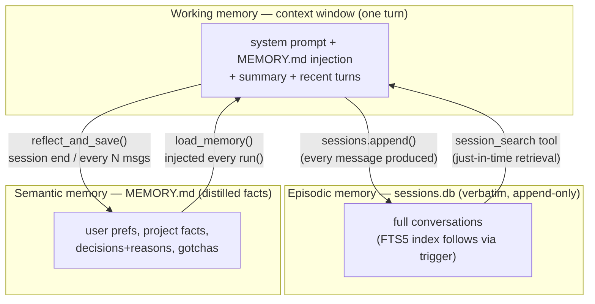
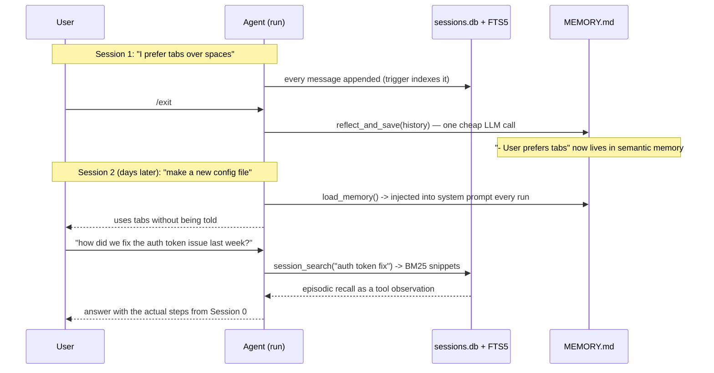

# Phase 7 — Long-Term Memory: FTS5 Search, MEMORY.md & Reflection

**Goal:** the agent stops forgetting *between* tasks. Sessions (Phase 3) preserved history but nothing ever *looked back* at it. This phase closes the memory hierarchy: the agent can search its own past and carry durable knowledge forward.

---

## 1. Theory (in detail)

### 1.1 The memory hierarchy, completed

Three phases built three tiers without naming them:

| Tier | Storage | Lifetime | Built in |
|---|---|---|---|
| **Working memory** | The context window | One turn | P1–3 |
| **Episodic memory** | `sessions.db` (verbatim conversations) | Forever, but never queried | P3 |
| **Semantic memory** | Distilled facts without their episodes | Forever | **P7** |

Humans work the same way: you remember *that* your friend is allergic to peanuts (semantic) without remembering the dinner where you learned it (episodic). Phase 7 builds the missing tier two ways: **retrieval** (search the episodes on demand — FTS5) and **distillation** (extract durable facts into `MEMORY.md` — reflection).

The tiers serve different failures: compression fixes *within-task* forgetting; sessions fix *durability*; search and reflection fix *recall* — having the data but never finding or using it.



### 1.2 FTS5: search over your own past

Phase 3 chose SQLite partly "for Phase 7." Here's the payoff. The agent gets a `session_search` tool backed by:

```sql
CREATE VIRTUAL TABLE messages_fts USING fts5(
    content, role, session_id,
    content='messages', content_rowid='id');   -- external content: no row copies
CREATE TRIGGER messages_fts_ai AFTER INSERT ON messages BEGIN
    INSERT INTO messages_fts(rowid, content, role, session_id)
    VALUES (new.id, new.content, new.role, new.session_id);
END;
```

Why FTS5 and not the alternatives:

- **vs `LIKE '%query%'`**: LIKE scans every row every time — fine at 100 messages, dead at 100k. FTS5 builds an **inverted index** (word → rows containing it) at insert time, so search is near-instant at any size. Exactly how search engines work.
- **vs embeddings/vector search**: vectors need an embedding model, a vector store, and similarity tuning. FTS5 is built into SQLite (zero dependencies) and **BM25-ranked** — rare words ("ft5_virtual_table") score above common ones ("the"). Keyword search is right for *exact recall* ("which session fixed the auth bug?"). Vector search wins on *fuzzy recall* — a legitimate later upgrade, not the starting point. Hermes uses FTS5 for the same reason.
- **Design details that matter**: external-content table indexes the existing diary with no duplication; the trigger keeps sync so the **append-only invariant is untouched**; `rebuild_index()` back-fills rows written before the trigger existed (your Phase 3 DB); queries are OR'd *quoted* terms (syntax-error-proof against arbitrary model output); results are **snippets** (`>>highlight<<`), never full rows — recall obeys the same attention budget as every other tool output.

The deeper point: this is **just-in-time retrieval** (Anthropic) applied to memory. The agent doesn't hold past sessions in context; it holds the *ability to look*.

### 1.3 MEMORY.md: distilled knowledge that survives

Search solves recall of *episodes*; some knowledge should not require recall at all. "User prefers tabs" shouldn't be re-discovered every session — it should be *loaded, always*. That's `MEMORY.md`, injected into the system prompt tier every `run()`.

The three-way distinction (where implementations usually break):

| File | Kind of truth | Rewrite policy | Example |
|---|---|---|---|
| `todo.md` (P5) | Plan — what to do now | Freely rewritten, disposable | "[ ] fix import bug" |
| `MEMORY.md` (P7) | Facts — what's true | Edited, pruned, slow-changing | "User prefers tabs; project uses pytest" |
| `sessions.db` (P3) | History — what happened | Append-only, never rewritten | The full conversation |

Three kinds of truth, three storage disciplines — the P5 lesson, one level up.

**Why a file with a hard cap?** It's loaded *every* session, so it must stay small (~2k tokens / 8000 chars). Memory that only grows becomes the context-rot problem again, one level up. The cap forces curation: the reflection step must *merge and prune*, not append forever. Pruning drops the **oldest lines first** (newest facts are most likely still true), with a hard-slice fallback for degenerate single-line output.

### 1.4 Reflection: who writes memory, and when

The agent writes its own memory — a **reflection step**: one cheap LLM call reviews existing memory + the recent transcript and extracts *what's worth keeping*:

- **User preferences** ("wants terse answers, hates emojis")
- **Project facts** ("the API needs the beta header on /v2")
- **Decisions and their reasons** ("chose SQLite because Phase 7 needs FTS5")
- **Gotchas** ("that test hangs without a network")

What *doesn't* qualify: task progress (todo's job), verbatim history (sessions' job), anything derivable from the repo. The prompt is the precision lever — recall-first-then-precision applies: over-save initially, prune once you see what's actually re-used.

**Three triggers:** `/reflect` (manual), **every 5 exchanges** (long conversations), and **session end** (`/exit`, Ctrl-C). The last is the elegant one — the moment of forgetting into a summary becomes the moment of remembering into memory. Reflection failures degrade, never break: the existing memory is kept and a warning printed (the Phase 6 ladder rule).

### 1.5 The loop becomes self-referential — carefully

Two hazards, both already covered by existing rules:

1. **Untrusted content, again.** Old sessions contain tool outputs from the outside world — searching them re-imports potentially injected text. Phase 2 holds: search *results* are observations; sandbox and approval still guard everything the agent does with them. Nothing new to build; everything old to trust.
2. **Context cost of remembering.** Search results are tool outputs — truncated (`MAX_TOOL_OUTPUT`), compressed when old (Phase 3). MEMORY.md gets its size cap for exactly this reason. Memory features obey the attention budget like everything else.

### 1.6 Architecture

- `agent/memory.py`: `load_memory()`, `reflect_and_save(history)` — the extraction call + merge + cap. No SQLite, no tools.
- `agent/sessions.py`: FTS5 table + trigger + `search()` + `rebuild_index()` — storage owns its own index.
- `tools/memory_search.py`: the handler — query → BM25 snippets with session ids (so the agent can ask the user to `/resume`).
- `tools/registry.py`: one schema + one `REGISTRY` entry (a plain tool — no interception needed, unlike `finish`/`delegate_task`).
- `agent/loop.py`: 5 lines — inject `load_memory()` into the system prompt. Safe on every run: messages are rebuilt fresh each call and history excludes the system prompt, so it never duplicates or compounds.
- `main.py`: three reflection triggers + `/memory` + `/reflect`.

Layering test, one last time: memory is a tool and two call points. Nothing about security, compression, sub-agents, or resilience changed — and the Telegram adapter (final phase) inherits all of it for free.

---

## 2. Papers / resources to study (skim)

| Resource | Take |
|---|---|
| [Hermes docs — memory & session_search](https://github.com/nousresearch/hermes-agent) | The production shape being replicated; FTS5 + memory tool |
| [SQLite FTS5 docs](https://www.sqlite.org/fts5.html) | External-content tables, triggers, BM25 — the implementation manual |
| [Anthropic — effective context engineering](https://www.anthropic.com/engineering/effective-context-engineering-for-ai-agents) | Re-read: agentic memory + just-in-time sections |
| [MemGPT — arXiv 2310.08560](https://arxiv.org/abs/2310.08560) | Re-read: the archival/recall tier now being built |
| [BM25 — Robertson & Zaragoza (IR textbook)](https://nlp.stanford.edu/IR-book/html/htmledition/okapi-bm25-a-non-binary-model-1.html) | Why rare-word matching ranks higher |

## 3. Main readings (properly — 3)

1. **Generative Agents (Park et al., 2304.03442)** — [arXiv](https://arxiv.org/abs/2304.03442). The origin of agent memory streams and *reflection as a scheduled LLM step*. Read §4 (memory stream, retrieval, reflection); skim the simulation. Your `reflect_and_save` is a miniature of their reflection mechanism.
2. **SQLite FTS5 docs** — [sqlite.org/fts5.html](https://www.sqlite.org/fts5.html). Not a paper, but the document you code against directly. External-content + triggers sections are mandatory before touching the schema.
3. **MemGPT (2310.08560)** — [arXiv](https://arxiv.org/abs/2310.08560). Re-read with new eyes: main context (P1–3), external context (P3) are built; this phase completes the *archival storage + recall functions* half of its hierarchy.

---

## 4. Code — the key parts

**`agent/sessions.py`** — the index IS the design (see §1.2 for full SQL). Search side:

```python
def search(query, limit=5):
    terms = [f'"{t}"' for t in query.split() if t]     # OR'd quoted terms:
    if not terms:                                      # safe against FTS
        return []                                      # syntax errors
    sql = ("SELECT session_id, role, "
           "snippet(messages_fts, 0, '>>', '<<', ' ... ', 15) "
           "FROM messages_fts WHERE messages_fts MATCH ? "
           "ORDER BY bm25(messages_fts) LIMIT ?")
    ...
def rebuild_index():   # back-fills pre-trigger rows: 'INSERT INTO
    ...                # messages_fts(messages_fts) VALUES("rebuild")'
```

**`agent/memory.py`** — reflection = one call + merge + cap:

```python
REFLECT_SYSTEM = ("...extract only DURABLE facts... Do NOT include task "
                  "progress, one-off details, anything derivable from the "
                  "repo... Merge with existing memory... Output ONLY bullet "
                  "lines. Maximum 40 lines. If nothing changed, return "
                  "existing memory unchanged.")

def reflect_and_save(history) -> str:
    transcript = "[-400c/line rows]..."[-6000:]        # recent slice only
    try:
        out = chat([reflect_system, current_memory + transcript], tools=None)
        new = out.get("content").strip()
    except Exception as e:
        print(f"[memory] reflection failed; keeping existing")   # ladder
        return current
    if not new or new.lower().startswith("(nothing"):
        return current                                  # no-op path
    if len(new) > MAX_MEMORY_CHARS:                     # deterministic cap:
        ...prune oldest lines first...                  # curation forced
        new = "\n".join(kept) if kept else new[:MAX_MEMORY_CHARS]
    write(MEMORY_PATH, new)
    return new
```

**`tools/memory_search.py`** — the whole handler is query hygiene + snippet shaping:

```python
def handle_session_search(args):
    query = str(args.get("query", "")).strip()
    if not query:
        return "ERROR: 'query' is required (keywords...)"
    sessions.rebuild_index()               # no-op if current
    hits = sessions.search(query, limit)
    if not hits:
        return f"No past session matches '{query}'."
    return ("Past session matches (BM25-ranked; session ids can be "
            "/resume-d):\n" + "\n".join(f"[{sid} | {role}] {snippet}" ...))
```

**`agent/loop.py`** — the entire injection (safe on every run — see §1.6):

```python
sys_content = SYSTEM_PROMPT
memory = load_memory()
if memory:
    sys_content += "\n\n[PERSISTENT MEMORY — facts from past sessions]\n" + memory
messages = [{"role": "system", "content": sys_content}] + (history or [])
```

**`main.py`** — the three triggers + two commands:

```python
REFLECT_EVERY = 5
...on /exit and Ctrl-C:  reflect_and_save(history)   # session end
...after each exchange:  if exchanges % REFLECT_EVERY == 0: reflect_and_save(history)
.../memory -> print load_memory()   |   /reflect -> reflect_and_save(history)
...startup: sessions.rebuild_index()
```

---

## 5. How it all works together

**A fact's round-trip through the hierarchy:**



**The two recalls compose:** semantic memory answers "what is *always* true" (loaded, zero recall cost); episodic search answers "what happened *once*" (recalled on demand, paid per query). A well-behaved agent uses MEMORY.md by default and `session_search` when it needs specifics — the tool descriptions teach exactly this split.

**Verified offline (smoke test):** FTS5 available; search finds the 2 auth-token rows and skips the unrelated row; snippet markers present; no-match returns empty; reflect+save round-trip stores extracted facts; size cap enforced (with hard-slice fallback); no-change path leaves memory untouched; everything compiles. Temp DB/test cleaned up.

## 6. Exam (phase done when all pass)

| # | Test | Passes when |
|---|---|---|
| 1 | Mention a durable fact ("I prefer tabs"), `/reflect` or `/exit`, `/new`, ask about preferences | Answered from MEMORY.md without being told |
| 2 | Session fixes a bug → new session → "search past sessions for the token fix" | `session_search` returns the right snippets with session ids |
| 3 | Query with no past match | Clean "No past session matches" observation; agent says so instead of hallucinating |
| 4 | Run with an existing Phase 3 `sessions.db` | `rebuild_index()` back-fills; old sessions searchable |
| 5 | Force MEMORY.md past 8k chars (verbose model) | Oldest lines pruned; file stays under cap; newest facts survive |
| 6 | Normal short task | Byte-identical behavior minus the memory injection line — memory adds no cost when empty |

**Commit:** *"agent remembers between tasks: FTS5 episodic recall + LLM-reflected semantic memory (MEMORY.md)."*
